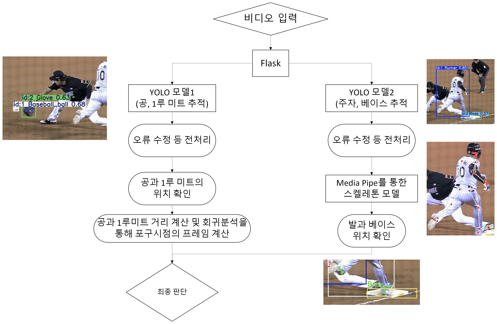

<h2>1루 베이스 포스 아웃/세이프 상황에 대한 비디오 판독 자동화</h2>

<h4>YOLO V11을 통한 데이터 학습</h4> 
['Runner', 'Base', 'Baseball_ball', 'Fielder1', 'Glove'] 
기준으로 라벨링 되어있는 데이터 활용 
학습에 활용하는 데이터 출처 https://www.aihub.or.kr/aihubdata/data/view.do?currMenu=&topMenu=&aihubDataSe=data&dataSetSn=71726

<h4>사용 모델 및 언어</h4>
YOLO V11, MediaPipe
Flask
Python

<h4> Demo Video </h4>

<h4> framework </h4>

<h4>기능 요약</h4>

1. 서버를 통해 영상 입력 (영상은 공과 주자 등 움직임을 명확하게 인식할 수 있어야 함)
2. YOLO V11 통해 학습된 모델 1로 공과 글러브 인식, 이후 포구 시점 파악
3. YOLO V11 통해 학습된 모델 2로 베이스와 주자 인식, 이후 MediaPipe를 통해 주자의 발 좌표 인식
4. 포구시점 시 주자의 발과 베이스 위치를 파악, 주자가 베이스를 밟았으면 safe, 밟지 못했으면 out으로 판정 가능

<h4> 결론 및 제언 </h4>
본 프로젝트를 통해 YOLO V11과 MediaPipe를 결합하여 1루 베이스 포스 아웃/세이프 상황에서 판정을 자동화하는 알고리즘을 설계할 수 있었다.

다만 현재 알고리즘의 수준에서는 상황이 제한되어 있기에, 향후 프로젝트에서는 일반적인 상황으로의 확장을 계획하고 있다. 현재는 1루에서 포스 아웃/세이프만 판정 가능한 수준이기에, 태그 플레이로도 적용을 확장할 필요가 있다. 또한 베이스를 밟았는지 여부에 대해서도 추가적인 알고리즘을 통해 정확성을 높일 필요가 있다.

이를 통해 범용성과 정확성을 높여 실제 경기에 사용 수 있는 수준으로 끌어올릴 필요가 있다.
